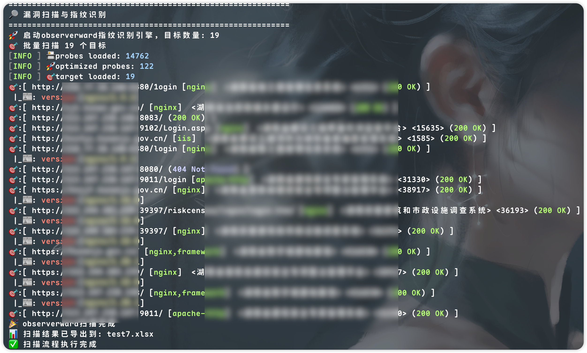
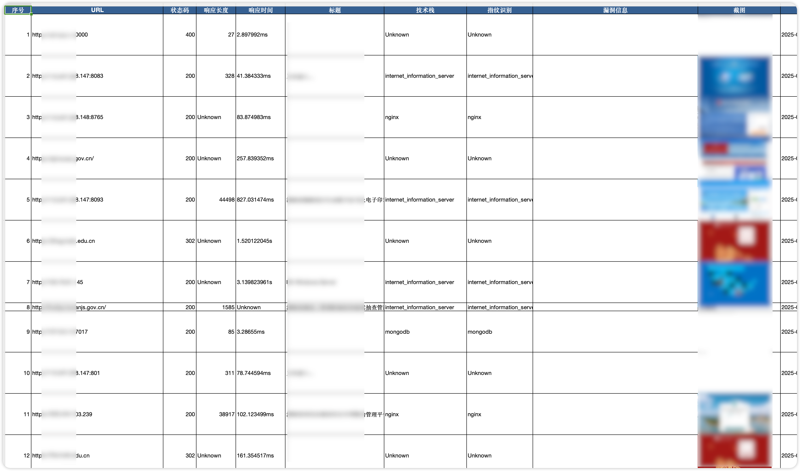
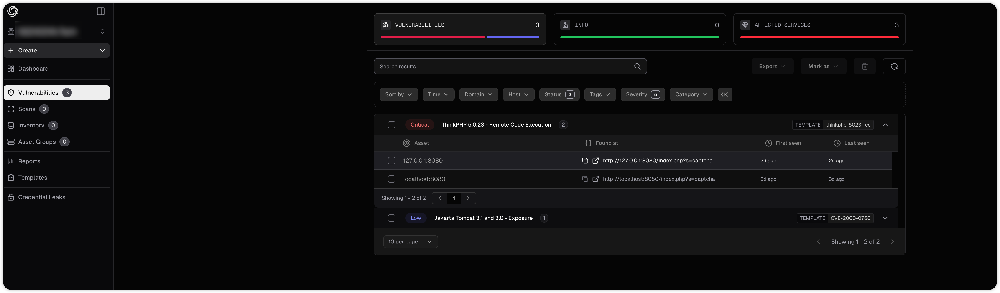

<h1 align="center">LiQiu</h1>

<p align="center">
  
</p>

<p align="center">
  <strong>红队工作流一键快速测试扫描工具</strong><br>
  具备端口扫描、协议检测、存活检测、指纹识别、漏洞扫描等功能
</p>

---

## 功能特性

- **资产管理**: 对资产进行分拣归类并去重，包括URL地址、主域名、子域名、IP地址等
- **端口扫描**: 采用gogo进行高效端口扫描（As library）
- **存活检测**: 使用httpx进行存活检测以及网页截图（As library）
- **指纹识别**: 采用observer_ward进行指纹识别（二进制程序）
- **漏洞扫描**: 默认调用nuclei进行漏洞扫描（二进制程序），对扫描结果输出到xlsx文件
- **空间测绘**: 支持FOFA及Quake的空间测绘进行相关资产搜集

## 快速开始

LiQiu旨在解决红队工作流中的初步打点信息收集问题，支持资产测绘和端口扫描、探测存活、指纹识别及漏洞利用功能。

```bash
Usage:
  liqiu [command]

Available Commands:
  asm         网络空间资产测绘功能
  completion  Generate the autocompletion script for the specified shell
  help        Help about any command
  scan        端口扫描、探测存活、指纹识别及漏洞利用功能

Flags:
  -h, --help   help for liqiu

Use "liqiu [command] --help" for more information about a command.
```

## 环境配置

### 必要组件配置

需要自行配置安装observerward和nuclei的路径到终端环境变量。
需要自行配置fofa和quake的api key到config.yaml文件中。
```
fofa: ["fofa api key"]
quake: ["quake api key"]
```

**httpx配置**:
- 参考文档: [Ubuntu20.04安装chrome和chromedriver](https://blog.csdn.net/weixin_44184990/article/details/123590435)

**Observer Ward配置**:
- 参考文档: [Observer Ward集成nuclei验证漏洞](https://github.com/emo-crab/observer_ward?tab=readme-ov-file#%E9%9B%86%E6%88%90nuclei%E9%AA%8C%E8%AF%81%E6%BC%8F%E6%B4%9E)

**Nuclei配置**:
- 需要配置auth key，会自动上传漏洞信息到nuclei cloud
- 参考文档: [Nuclei Cloud本地扫描配置](https://docs.projectdiscovery.io/cloud/scanning/internal-scan#method-2%3A-local-scanning-%26-upload)


### 使用示例

**默认端口扫描**（使用red2scan系列端口）:
```bash
./liqiu scan -i example/targets.txt --httpx --obclei -f 文件名
```

**指定端口扫描**:
```bash
./liqiu scan -i example/targets.txt -p 80,443,8080 --httpx --obclei -f 文件名
```

> **注意**: 不指定端口时，默认扫描red2scan系列端口（包含常见的Web端口、数据库端口、服务端口等）

## 主动扫描功能

对目标进行端口扫描、存活探测、指纹识别、漏洞利用，支持多种输入格式和输出选项。

### 命令参数

```bash
Usage:
  liqiu scan [flags]

Flags:
  -e, --exploit                    启用neutron漏洞扫描
  -f, --file string                输出文件名
  -t, --gthread int                gogo并发线程数 (default 1000)
  -h, --help                       help for scan
      --httpx                      启用httpx web扫描
      --httpx-threads int          httpx并发线程数 (default 50)
  -i, --input string               被扫描的目标,包括各种格式的目标输入
      --obclei                     启用observerward指纹识别和nuclei漏洞扫描
      --observerward-threads int   observerward并发线程数 (default 10)
  -p, --port string                扫描端口,支持单个端口、端口范围、逗号分隔等格式,如: 80,443,8000-8100
  -x, --proxy strings              socks5代理, e.g. socks5://127.0.0.1:11111
```

### 扫描演示

**扫描过程**:
<p align="center">
  
</p>

<p align="center">
  
</p>

**结果导出**:
<p align="center">
  
</p>

**漏洞可视化**:
<p align="center">
  
</p>

## 空间测绘功能

使用FOFA或Quake进行网络空间资产测绘，快速收集目标相关资产信息。

### 命令参数

```bash
Usage:
  liqiu asm [flags]

Flags:
  -f, --file string      输出文件名
      --fofa             启用FOFA搜索
      --fofa-excel       将FOFA搜索结果导出到Excel文件
      --fofa-json        以JSON格式输出FOFA所有字段搜索结果
      --fofa-size int    FOFA搜索结果数量(默认100) (default 100)
  -h, --help             help for asm
  -i, --input string     被扫描的目标,包括各种格式的目标输入
      --quake            启用Quake搜索
      --quake-excel      将Quake搜索结果导出到Excel文件
      --quake-json       以JSON格式输出Quake所有字段搜索结果
      --quake-size int   Quake搜索结果数量(默认100) (default 100)
```

### 测绘演示

<p align="center">
  
</p>

---

## 开发计划

- [ ] **资产处理优化** - 改进资产分类和去重逻辑
- [ ] **域名扫描优化** - 提升域名扫描效率和准确性  
- [ ] **结果推送** - 支持Bot/邮件推送扫描结果
- [ ] **更多功能** - 持续完善工具功能

## 致谢

感谢所有开源项目的贡献者，特别是：
- [gogo](https://github.com/chainreactors/gogo) - 高性能端口扫描器
- [httpx](https://github.com/projectdiscovery/httpx) - HTTP工具包
- [observer_ward](https://github.com/emo-crab/observer_ward) - Web指纹识别
- [nuclei](https://github.com/projectdiscovery/nuclei) - 漏洞扫描引擎
- [快速打点](https://ruoji6.github.io/posts/24712.html) - 快速打点思考